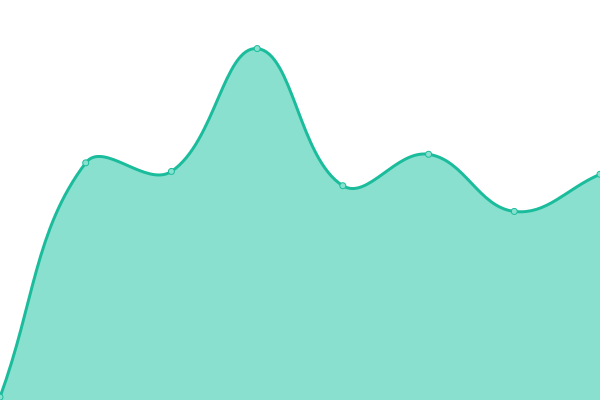
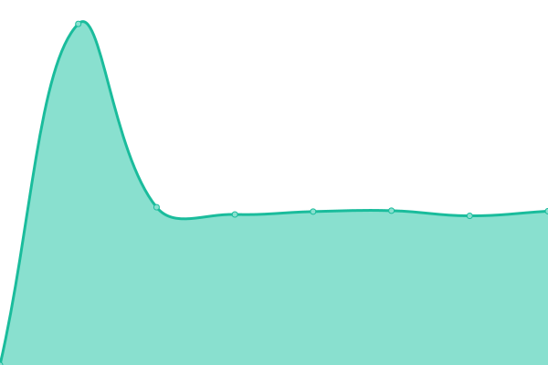
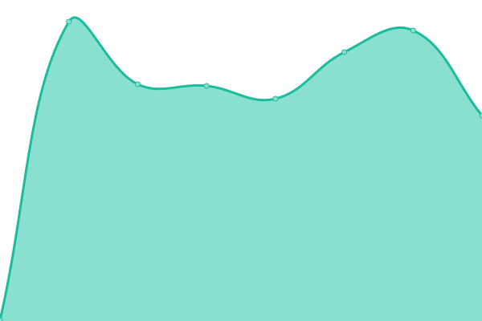

# [📈 Live Status](https://demo.upptime.js.org): <!--live status--> **🟧 Partial outage**

This repository contains the open-source uptime monitor and status page for [Upptime](https://upptime.js.org), powered by [Upptime](https://github.com/upptime/upptime).

With [Upptime](https://upptime.js.org), you can get your own unlimited and free uptime monitor and status page, powered entirely by a GitHub repository. We use [Issues](https://github.com/upptime/upptime/issues) as incident reports, [Actions](https://github.com/remgi/upptime/actions) as uptime monitors, and [Pages](https://demo.upptime.js.org) for the status page.

<!--start: status pages-->
<!-- This summary is generated by Upptime (https://github.com/upptime/upptime) -->
<!-- Do not edit this manually, your changes will be overwritten -->
<!-- prettier-ignore -->
| URL | Status | History | Response Time | Uptime |
| --- | ------ | ------- | ------------- | ------ |
|  [Google](https://www.google.com) | 🟩 Up | [google.yml](https://github.com/remgi/uptimecic/commits/HEAD/history/google.yml) | 

 128ms
     
 | 

<a href="https://remgi.github.io/uptimecic/history/google">100.00%</a>
    

|  [CRM CIVIX](https://crm.civix.mx) | 🟩 Up | [crm-civix.yml](https://github.com/remgi/uptimecic/commits/HEAD/history/crm-civix.yml) | 

 797ms
     
 | 

<a href="https://remgi.github.io/uptimecic/history/crm-civix">98.89%</a>
    

|  [ADMIN CIVIX](https://admin.civix.mx) | 🟩 Up | [admin-civix.yml](https://github.com/remgi/uptimecic/commits/HEAD/history/admin-civix.yml) | 

 4529ms
     
 | 

<a href="https://remgi.github.io/uptimecic/history/admin-civix">99.64%</a>
    

|  [Analisis CIVIX](https://analisis.civix.mx) | 🟩 Up | [analisis-civix.yml](https://github.com/remgi/uptimecic/commits/HEAD/history/analisis-civix.yml) | 

 1934ms
     
 | 

<a href="https://remgi.github.io/uptimecic/history/analisis-civix">100.00%</a>
    

|  [Sitio CIC](https://cic.mx) | 🟩 Up | [sitio-cic.yml](https://github.com/remgi/uptimecic/commits/HEAD/history/sitio-cic.yml) | 

 1328ms
     
 | 

<a href="https://remgi.github.io/uptimecic/history/sitio-cic">100.00%</a>
    

|  [Libres de Extorsion](https://libresdeextorsion.mx) | 🟩 Up | [libres-de-extorsion.yml](https://github.com/remgi/uptimecic/commits/HEAD/history/libres-de-extorsion.yml) | 

 7661ms
     
 | 

<a href="https://remgi.github.io/uptimecic/history/libres-de-extorsion">100.00%</a>
    

|  [DONA CIC](https://dona.cic.mx) | 🟩 Up | [dona-cic.yml](https://github.com/remgi/uptimecic/commits/HEAD/history/dona-cic.yml) | 

 402ms
     
 | 

<a href="https://remgi.github.io/uptimecic/history/dona-cic">100.00%</a>
    

|  [APOYA CIC](https://apoya.cic.mx) | 🟥 Down | [apoya-cic.yml](https://github.com/remgi/uptimecic/commits/HEAD/history/apoya-cic.yml) | 

 447ms
     
 | 

<a href="https://remgi.github.io/uptimecic/history/apoya-cic">71.48%</a>
    

|  [Sitio CIVIX](https://civix.mx/home/) | 🟩 Up | [sitio-civix.yml](https://github.com/remgi/uptimecic/commits/HEAD/history/sitio-civix.yml) | 

 6504ms
     
 | 

<a href="https://remgi.github.io/uptimecic/history/sitio-civix">99.44%</a>
    

|  [Reportar CIC](https://reportar.cic.mx) | 🟩 Up | [reportar-cic.yml](https://github.com/remgi/uptimecic/commits/HEAD/history/reportar-cic.yml) | 

 716ms
     
 | 

<a href="https://remgi.github.io/uptimecic/history/reportar-cic">99.62%</a>
    

<!--end: status pages-->

[**Visit our status website →**](https://demo.upptime.js.org)

## 📄 License

- Powered by: [Upptime](https://github.com/upptime/upptime)
- Code: [MIT](./LICENSE) © [Upptime](https://upptime.js.org)
- Data in the `./history` directory: [Open Database License](https://opendatacommons.org/licenses/odbl/1-0/)
